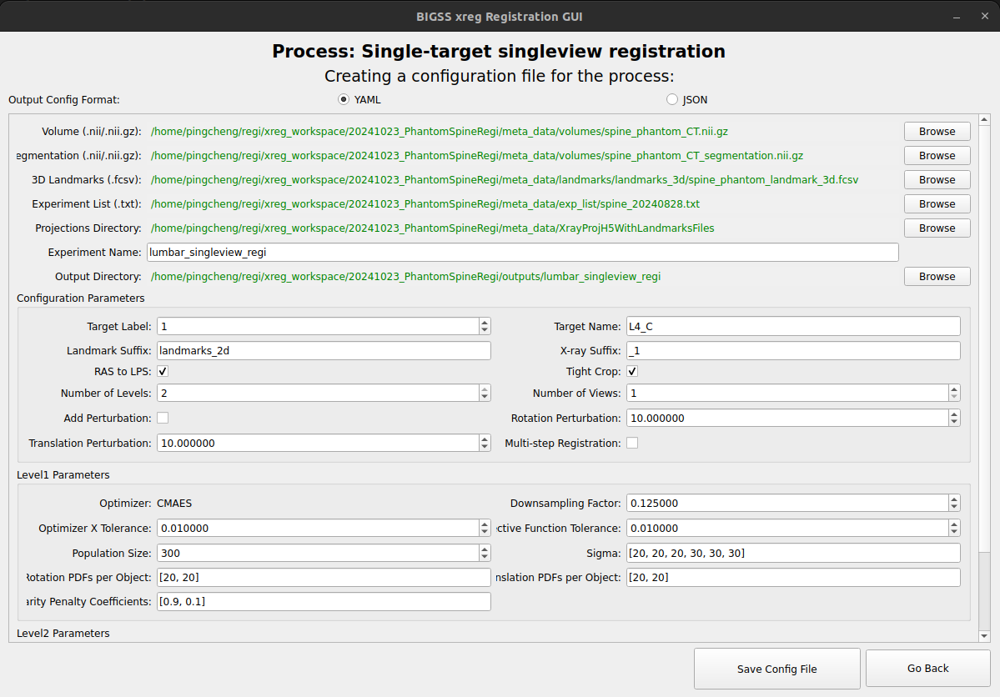

Config Window
=============

The **Config Window** allows you to create or edit a configuration file for the selected process (registration and DRR generation).

Overview
--------

   The Config Window for creating configurations.

Components
----------

1. **Config Format Selection**

   - Choose between **YAML** or **JSON** format. The current xreg executable only supports JSON configuration files. The YAML format is mainly reserved for ROS2 compatiblity in the future.

2. **Configuration Fields**

   - Dynamically generated fields based on the process requirements.
   - Includes file paths, numerical parameters, and boolean options.
   - Hover over the field labels for tooltips of descriptions and instructions.

