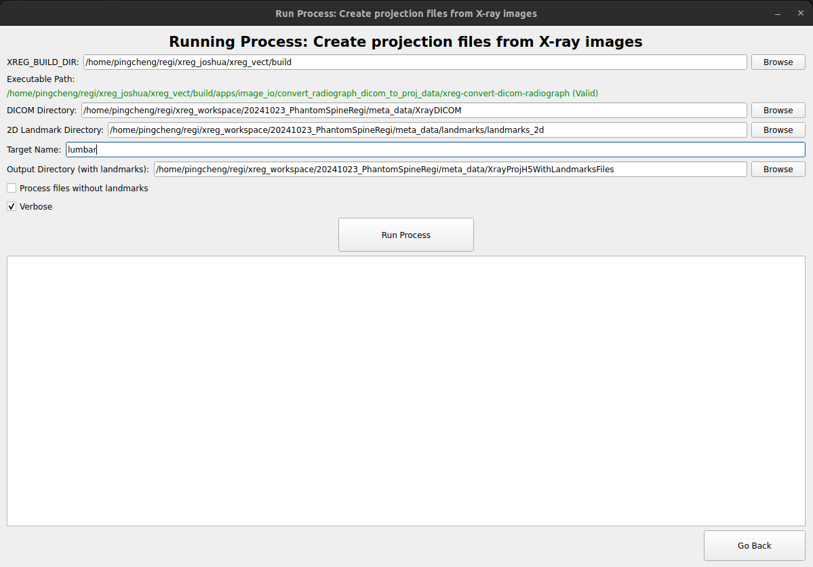

Run Projection Process Window
=============================

The **Run Projection Process Window** is specific to processes that create projection files from raw X-ray images. The generated projection files are in xreg HDF5 (Hierarchical Data) format and can include landmarks for registration purposes. 

Overview
--------

   The Run Projection Process Window for generating projections.

Include a screenshot of the Run Projection Process Window here.

Components
----------

1. **XREG_BUILD_DIR Selection**

   - As in the Run Process Window.

2. **DICOM Directory Selection**

   - Path to the directory containing DICOM images. This is defaulted to `<working_dir>/meta_data/XrayDICOM`. 

3. **Landmark Directory Selection**

   - Path to the directory containing 2D landmarks. This is defaulted to `<working_dir>/meta_data/landmarks/landmarks_2d`. Make sure that the 2D landmarks are named in the format `<X-ray ID>_<target_name>_landmark_2d.fcsv`.

4. **Target Name Input**

   - Field to specify the target anatomy name. It is possible that in the scene there are landmarks from different anatomies that we plan to register. This field allows the user to specify which anatomy will be stored into the processed HDF5 file.

5. **Process Without Landmarks Checkbox**

   - Option to process files and save the projection files even if the corresponding 2D landmarks are missing.

6. **Output Directories**

   - Directory where output projection HDF5 files will be saved. This is defaulted to `<working_dir>/meta_data/XrayProjH5WithLandmarksFiles` (assuming landmarks are present) and `<working_dir>/meta_data/XrayProjH5WithoutLandmarksFiles` (if processed without landmarks).

