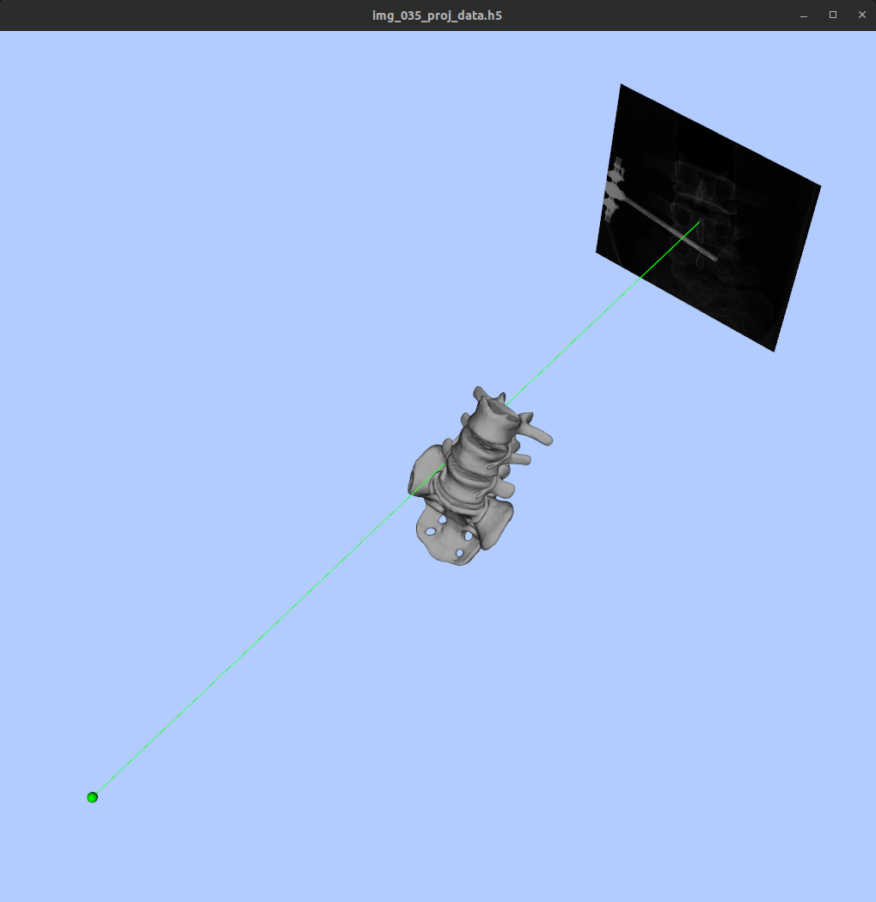

Visualize Window
================

The **Visualize Window** allows you to visualize registration results or scenes after running a registration process.

Overview
--------

.. figure:: images/visualize_window.png
   :align: center
   :width: 80%

   The Visualize Window for viewing registration scenes.

Include a screenshot of the Visualize Window here.

Components
----------

1. **XREG_BUILD_DIR Selection**

   - As in previous windows.

2. **Model Path Selection**

   - Path to the 3D model file (e.g., .stl, .obj). This should be the same anatomical structure that was used in the registration process. Ensure that the coordinates of the 3D model also matches its original 3D volume (One way to do this is to export the models directly in 3D slicer)

3. **Image ID Input**

   - Field to specify which X-ray ID to visualize, (e.g. 031, 032, ...)

4. **Output Display**

   - Shows process output and any terminal messages.

Example Scenes
---------------

These are two example interactive scenes that are visualized after running a singleview lumbar phantom registration process.

.. image:: images/vis_1.png
   :width: 300px
   :align: left

.. raw:: html

   

Visualization Controls
------------------------

TO BE ADDED

Notes
-----

- The visualization requires the corresponding projection and transformation files (By default they should all be generated in the previous registration process under the `outputs` folder).

